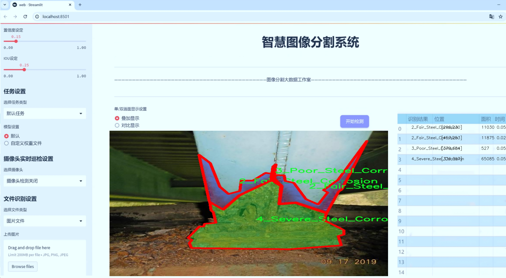

# 钢铁腐蚀程度分割系统： yolov8-seg-C2f-EMSC

### 1.研究背景与意义

[参考博客](https://gitee.com/YOLOv8_YOLOv11_Segmentation_Studio/projects)

[博客来源](https://kdocs.cn/l/cszuIiCKVNis)

研究背景与意义

随着工业化进程的加快，钢铁作为一种重要的结构材料，在建筑、交通、能源等多个领域得到了广泛应用。然而，钢铁在使用过程中容易受到环境因素的影响，导致腐蚀现象的发生，进而影响其使用寿命和安全性。根据统计，全球每年因钢铁腐蚀造成的经济损失高达数千亿美元，这不仅对企业造成了巨大的经济负担，也对社会的可持续发展构成了威胁。因此，及时、准确地检测和评估钢铁的腐蚀程度，成为了当前材料科学与工程领域亟待解决的重要课题。

传统的钢铁腐蚀检测方法多依赖于人工目测和传统的物理检测手段，这些方法不仅耗时耗力，而且在检测精度和效率上存在一定的局限性。随着计算机视觉和深度学习技术的迅猛发展，基于图像处理的自动化检测方法逐渐成为研究的热点。YOLO（You Only Look Once）系列模型以其高效的实时目标检测能力，逐渐被应用于各类图像分割和识别任务中。YOLOv8作为该系列的最新版本，凭借其在速度和精度上的显著提升，为钢铁腐蚀检测提供了新的技术手段。

本研究旨在基于改进的YOLOv8模型，构建一个钢铁腐蚀程度分割系统。通过对特定数据集的训练与测试，我们将实现对不同腐蚀程度的钢铁表面进行准确的分割与分类。该数据集包含1000幅图像，涵盖了三种腐蚀程度的钢铁样本，分别为“2_Fair_Steel_Corrosion”、“3_Poor_Steel_Corrosion”和“4_Severe_Steel_Corrosion”。通过对这些图像的深入分析，我们能够提取出腐蚀特征，进而训练出高效的模型，实现对钢铁腐蚀的自动化检测。

研究的意义不仅在于提高钢铁腐蚀检测的效率和准确性，更在于推动相关领域的技术进步。通过引入深度学习和计算机视觉技术，我们可以实现对腐蚀程度的实时监测，为钢铁结构的维护和管理提供科学依据。此外，该系统的成功应用将为其他材料的腐蚀检测提供借鉴，促进跨学科的技术融合与创新。

综上所述，基于改进YOLOv8的钢铁腐蚀程度分割系统的研究，不仅具有重要的理论价值，还有着广泛的实际应用前景。通过该研究，我们希望能够为钢铁行业的智能化发展贡献一份力量，同时为保障公共安全和推动可持续发展提供有力支持。

### 2.图片演示




注意：本项目提供完整的训练源码数据集和训练教程,由于此博客编辑较早,暂不提供权重文件（best.pt）,需要按照6.训练教程进行训练后实现上图效果。

### 3.视频演示

[3.1 视频演示](https://www.bilibili.com/video/BV12JzbYcE1G/)

### 4.数据集信息

##### 4.1 数据集类别数＆类别名

nc: 3
names: ['2_Fair_Steel_Corrosion', '3_Poor_Steel_Corrosion', '4_Severe_Steel_Corrosion']


##### 4.2 数据集信息简介

数据集信息展示

在现代工业生产中，钢铁材料的腐蚀问题日益受到重视，尤其是在重工业和基础设施建设领域。为了有效监测和评估钢铁腐蚀程度，研究人员开发了一种基于YOLOv8-seg的钢铁腐蚀程度分割系统。该系统的训练依赖于一个名为“json to yolo”的数据集，该数据集专门针对钢铁腐蚀的不同程度进行了标注和分类，旨在提高模型的分割精度和实用性。

“json to yolo”数据集包含了三种主要的腐蚀类别，分别是“2_Fair_Steel_Corrosion”、“3_Poor_Steel_Corrosion”和“4_Severe_Steel_Corrosion”。这三类腐蚀程度的划分，基于钢铁表面损伤的严重性，提供了一个清晰的框架，使得模型能够在不同的腐蚀状态下进行有效的识别和分割。其中，“2_Fair_Steel_Corrosion”代表轻微腐蚀，通常表现为表面有少量锈斑，影响较小；“3_Poor_Steel_Corrosion”则指中等程度的腐蚀，钢铁表面出现明显的锈蚀和剥落，结构完整性受到一定威胁；而“4_Severe_Steel_Corrosion”则是指严重腐蚀，钢铁材料可能已经出现了结构性损伤，急需进行修复或更换。

该数据集的构建过程经过精心设计，确保了数据的多样性和代表性。每一类腐蚀样本均经过专业人士的评估和标注，确保数据的准确性和可靠性。数据集中包含了大量的钢铁表面图像，这些图像不仅涵盖了不同光照条件下的钢铁表面，还包括了不同环境因素（如湿度、温度等）对腐蚀的影响。这样的设计使得模型在训练过程中能够学习到更为丰富的特征，从而在实际应用中具备更强的泛化能力。

在数据预处理阶段，所有图像均进行了标准化处理，以确保输入数据的一致性。同时，数据集还采用了数据增强技术，如旋转、缩放、翻转等，进一步增加了样本的多样性。这种增强策略不仅提升了模型的鲁棒性，还有效防止了过拟合现象的发生。

通过使用“json to yolo”数据集，改进后的YOLOv8-seg模型能够实现对钢铁腐蚀程度的高效分割与识别。这一系统的成功实施，将为钢铁行业的腐蚀监测提供强有力的技术支持，帮助相关企业及时发现和处理腐蚀问题，降低安全隐患，提高生产效率。此外，该数据集的构建和应用也为后续研究提供了宝贵的参考，推动了钢铁腐蚀检测技术的进一步发展。

总之，“json to yolo”数据集不仅是改进YOLOv8-seg模型训练的基础，更是推动钢铁腐蚀检测领域技术进步的重要里程碑。通过对腐蚀程度的精确分割与识别，该系统有望在未来的实际应用中发挥重要作用，为钢铁材料的维护和管理提供科学依据。


### 5.项目依赖环境部署教程（零基础手把手教学）

[5.1 环境部署教程链接（零基础手把手教学）](https://www.bilibili.com/video/BV1jG4Ve4E9t/?vd_source=bc9aec86d164b67a7004b996143742dc)


[5.2 安装Python虚拟环境创建和依赖库安装视频教程链接（零基础手把手教学）](https://www.bilibili.com/video/BV1nA4VeYEze/?vd_source=bc9aec86d164b67a7004b996143742dc)

### 6.手把手YOLOV8-seg训练视频教程（零基础手把手教学）

[6.1 手把手YOLOV8-seg训练视频教程（零基础小白有手就能学会）](https://www.bilibili.com/video/BV1cA4VeYETe/?vd_source=bc9aec86d164b67a7004b996143742dc)


按照上面的训练视频教程链接加载项目提供的数据集，运行train.py即可开始训练



     Epoch   gpu_mem       box       obj       cls    labels  img_size
     1/200     0G   0.01576   0.01955  0.007536        22      1280: 100%|██████████| 849/849 [14:42<00:00,  1.04s/it]
               Class     Images     Labels          P          R     mAP@.5 mAP@.5:.95: 100%|██████████| 213/213 [01:14<00:00,  2.87it/s]
                 all       3395      17314      0.994      0.957      0.0957      0.0843

     Epoch   gpu_mem       box       obj       cls    labels  img_size
     2/200     0G   0.01578   0.01923  0.007006        22      1280: 100%|██████████| 849/849 [14:44<00:00,  1.04s/it]
               Class     Images     Labels          P          R     mAP@.5 mAP@.5:.95: 100%|██████████| 213/213 [01:12<00:00,  2.95it/s]
                 all       3395      17314      0.996      0.956      0.0957      0.0845

     Epoch   gpu_mem       box       obj       cls    labels  img_size
     3/200     0G   0.01561    0.0191  0.006895        27      1280: 100%|██████████| 849/849 [10:56<00:00,  1.29it/s]
               Class     Images     Labels          P          R     mAP@.5 mAP@.5:.95: 100%|███████   | 187/213 [00:52<00:00,  4.04it/s]
                 all       3395      17314      0.996      0.957      0.0957      0.0845


### 7.50+种全套YOLOV8-seg创新点加载调参实验视频教程（一键加载写好的改进模型的配置文件）

[7.1 50+种全套YOLOV8-seg创新点加载调参实验视频教程（一键加载写好的改进模型的配置文件）](https://www.bilibili.com/video/BV1Hw4VePEXv/?vd_source=bc9aec86d164b67a7004b996143742dc)

### YOLOV8-seg算法简介

原始YOLOV8-seg算法原理

YOLOv8-seg作为YOLO系列的最新版本，继承并发展了YOLO系列模型的优良传统，其设计理念旨在实现更高效的目标检测与分割任务。自2015年YOLO模型首次发布以来，YOLO系列经历了多个版本的迭代，每个版本都在推理速度、精度、易用性及硬件兼容性等方面进行了显著的改进。YOLOv8不仅在这些方面表现出色，还原生支持自定义数据集，使其在实际应用中更加灵活和强大。

YOLOv8的网络结构主要由三部分组成：Backbone、Neck和Head。Backbone负责特征提取，通常采用高效的卷积神经网络架构，能够从输入图像中提取出丰富的特征信息。Neck则负责特征融合，利用不同层次的特征信息来增强模型的表现力。Head部分则是模型的输出层，通过解耦合的结构，将目标检测和分割任务分开处理，从而提高了模型的精度和效率。

在YOLOv8中，特征提取的过程经过了精心设计，使用了PAN-FPN（Path Aggregation Network - Feature Pyramid Network）结构，旨在充分利用不同尺度的特征信息。这一结构的创新之处在于去除了上采样部分的卷积结构，并引入了新的C2f模块，该模块结合了CSPBottleneck和ELAN模块的思想，增加了更多的残差连接，从而在保持轻量化的同时，提升了梯度信息的丰富性。这种设计使得YOLOv8在处理复杂场景时，能够更好地捕捉到细节信息，从而提高了分割的精度。

YOLOv8的Head部分采用了当前流行的解耦合头结构，这一结构的核心思想是将分类和检测任务分开处理，减少了任务之间的干扰，进而提高了模型的整体性能。此外，YOLOv8在Anchor的使用上进行了创新，采用了Anchor-Free的方法，这一改变使得模型在面对不同形状和大小的目标时，能够更加灵活地进行检测与分割。

在训练过程中，YOLOv8引入了动态的Task-Aligned Assigner样本分配策略，这一策略通过动态调整样本的分配，使得模型在训练过程中能够更好地适应不同的任务需求。此外，YOLOv8在数据增强方面也进行了优化，特别是在训练的最后阶段，关闭了马赛克增强，以减少训练过程中的噪声干扰，从而提高模型的稳定性和泛化能力。

在损失计算方面，YOLOv8采用了BCELoss作为分类损失，DFLLoss和CIoULoss作为回归损失，这种多损失函数的设计使得模型在训练过程中能够更好地平衡分类和回归任务的性能，从而提高了整体的检测精度。

YOLOv8-seg的设计理念不仅仅是为了提高检测和分割的精度，更是为了实现实时检测的目标。通过对模型的深度、宽度和通道数进行合理的设置，YOLOv8能够在不同的硬件平台上实现高效的推理。其模型的多样性体现在提供了多种不同尺度的模型选择，从而满足不同应用场景的需求。

总的来说，YOLOv8-seg在算法设计上充分考虑了目标检测与分割的实际需求，通过一系列创新的结构和策略，提升了模型的性能和适用性。无论是在苹果采摘等农业领域，还是在其他需要实时目标检测与分割的场景中，YOLOv8-seg都展现出了强大的能力和广泛的应用前景。通过结合现代深度学习技术与传统的目标检测思路，YOLOv8-seg为目标检测领域带来了新的冲击，标志着实时检测技术的又一次飞跃。


### 9.系统功能展示（检测对象为举例，实际内容以本项目数据集为准）

图9.1.系统支持检测结果表格显示

  图9.2.系统支持置信度和IOU阈值手动调节

  图9.3.系统支持自定义加载权重文件best.pt(需要你通过步骤5中训练获得)

  图9.4.系统支持摄像头实时识别

  图9.5.系统支持图片识别

  图9.6.系统支持视频识别

  图9.7.系统支持识别结果文件自动保存

  图9.8.系统支持Excel导出检测结果数据


### 10.50+种全套YOLOV8-seg创新点原理讲解（非科班也可以轻松写刊发刊，V11版本正在科研待更新）

#### 10.1 由于篇幅限制，每个创新点的具体原理讲解就不一一展开，具体见下列网址中的创新点对应子项目的技术原理博客网址【Blog】：


[10.1 50+种全套YOLOV8-seg创新点原理讲解链接](https://gitee.com/qunmasj/good)

#### 10.2 部分改进模块原理讲解(完整的改进原理见上图和技术博客链接)【如果此小节的图加载失败可以通过CSDN或者Github搜索该博客的标题访问原始博客，原始博客图片显示正常】

### YOLOv8简介

按照官方描述，YOLOv8 是一个 SOTA 模型，它建立在以前 YOLO 版本的成功基础上，并引入了新的功能和改进，以进一步提升性能和灵活性。具体创新包括一个新的骨干网络、一个新的 Ancher-Free 检测头和一个新的损失函数，可以在从 CPU 到 GPU 的各种硬件平台上运行。

不过 ultralytics 并没有直接将开源库命名为 YOLOv8，而是直接使用 ultralytics 这个词，原因是 ultralytics 将这个库定位为算法框架，而非某一个特定算法，一个主要特点是可扩展性。其希望这个库不仅仅能够用于 YOLO 系列模型，而是能够支持非 YOLO 模型以及分类分割姿态估计等各类任务。
总而言之，ultralytics 开源库的两个主要优点是：

融合众多当前 SOTA 技术于一体
未来将支持其他 YOLO 系列以及 YOLO 之外的更多算法


下表为官方在 COCO Val 2017 数据集上测试的 mAP、参数量和 FLOPs 结果。可以看出 YOLOv8 相比 YOLOv5 精度提升非常多，但是 N/S/M 模型相应的参数量和 FLOPs 都增加了不少，从上图也可以看出相比 YOLOV5 大部分模型推理速度变慢了。


额外提一句，现在各个 YOLO 系列改进算法都在 COCO 上面有明显性能提升，但是在自定义数据集上面的泛化性还没有得到广泛验证，至今依然听到不少关于 YOLOv5 泛化性能较优异的说法。对各系列 YOLO 泛化性验证也是 MMYOLO 中一个特别关心和重点发力的方向。

### YOLO-MS简介
实时目标检测，以YOLO系列为例，已在工业领域中找到重要应用，特别是在边缘设备（如无人机和机器人）中。与之前的目标检测器不同，实时目标检测器旨在在速度和准确性之间追求最佳平衡。为了实现这一目标，提出了大量的工作：从第一代DarkNet到CSPNet，再到最近的扩展ELAN，随着性能的快速增长，实时目标检测器的架构经历了巨大的变化。

尽管性能令人印象深刻，但在不同尺度上识别对象仍然是实时目标检测器面临的基本挑战。这促使作者设计了一个强大的编码器架构，用于学习具有表现力的多尺度特征表示。具体而言，作者从两个新的角度考虑为实时目标检测编码多尺度特征：

从局部视角出发，作者设计了一个具有简单而有效的分层特征融合策略的MS-Block。受到Res2Net的启发，作者在MS-Block中引入了多个分支来进行特征提取，但不同的是，作者使用了一个带有深度卷积的 Inverted Bottleneck Block块，以实现对大Kernel的高效利用。

从全局视角出发，作者提出随着网络加深逐渐增加卷积的Kernel-Size。作者在浅层使用小Kernel卷积来更高效地处理高分辨率特征。另一方面，在深层中，作者采用大Kernel卷积来捕捉广泛的信息。

基于以上设计原则，作者呈现了作者的实时目标检测器，称为YOLO-MS。为了评估作者的YOLO-MS的性能，作者在MS COCO数据集上进行了全面的实验。还提供了与其他最先进方法的定量比较，以展示作者方法的强大性能。如图1所示，YOLO-MS在计算性能平衡方面优于其他近期的实时目标检测器。


具体而言，YOLO-MS-XS在MS COCO上获得了43%+的AP得分，仅具有450万个可学习参数和8.7亿个FLOPs。YOLO-MS-S和YOLO-MS分别获得了46%+和51%+的AP，可学习参数分别为810万和2220万。此外，作者的工作还可以作为其他YOLO模型的即插即用模块。通常情况下，作者的方法可以将YOLOv8的AP从37%+显著提高到40%+，甚至还可以使用更少的参数和FLOPs。


#### Multi-Scale Building Block Design
CSP Block是一个基于阶段级梯度路径的网络，平衡了梯度组合和计算成本。它是广泛应用于YOLO系列的基本构建块。已经提出了几种变体，包括YOLOv4和YOLOv5中的原始版本，Scaled YOLOv4中的CSPVoVNet，YOLOv7中的ELAN，以及RTMDet中提出的大Kernel单元。作者在图2(a)和图2(b)中分别展示了原始CSP块和ELAN的结构。


上述实时检测器中被忽视的一个关键方面是如何在基本构建块中编码多尺度特征。其中一个强大的设计原则是Res2Net，它聚合了来自不同层次的特征以增强多尺度表示。然而，这一原则并没有充分探索大Kernel卷积的作用，而大Kernel卷积已经在基于CNN的视觉识别任务模型中证明有效。将大Kernel卷积纳入Res2Net的主要障碍在于它们引入的计算开销，因为构建块采用了标准卷积。在作者的方法中，作者提出用 Inverted Bottleneck Block替代标准的3 × 3卷积，以享受大Kernel卷积的好处。

基于前面的分析，作者提出了一个带有分层特征融合策略的全新Block，称为MS-Block，以增强实时目标检测器在提取多尺度特征时的能力，同时保持快速的推理速度。

MS-Block的具体结构如图2(c)所示。假设是输入特征。通过1×1卷积的转换后，X的通道维度增加到n*C。然后，作者将X分割成n个不同的组，表示为，其中。为了降低计算成本，作者选择n为3。

注意，除了之外，每个其他组都经过一个 Inverted Bottleneck Block层，用表示，其中k表示Kernel-Size，以获得。的数学表示如下：


根据这个公式，该博客的作者不将 Inverted Bottleneck Block层连接，使其作为跨阶段连接，并保留来自前面层的信息。最后，作者将所有分割连接在一起，并应用1×1卷积来在所有分割之间进行交互，每个分割都编码不同尺度的特征。当网络加深时，这个1×1卷积也用于调整通道数。

#### Heterogeneous Kernel Selection Protocol
除了构建块的设计外，作者还从宏观角度探讨了卷积的使用。之前的实时目标检测器在不同的编码器阶段采用了同质卷积（即具有相同Kernel-Size的卷积），但作者认为这不是提取多尺度语义信息的最佳选项。

在金字塔结构中，从检测器的浅阶段提取的高分辨率特征通常用于捕捉细粒度语义，将用于检测小目标。相反，来自网络较深阶段的低分辨率特征用于捕捉高级语义，将用于检测大目标。如果作者在所有阶段都采用统一的小Kernel卷积，深阶段的有效感受野（ERF）将受到限制，影响大目标的性能。在每个阶段中引入大Kernel卷积可以帮助解决这个问题。然而，具有大的ERF的大Kernel可以编码更广泛的区域，这增加了在小目标外部包含噪声信息的概率，并且降低了推理速度。

在这项工作中，作者建议在不同阶段中采用异构卷积，以帮助捕获更丰富的多尺度特征。具体来说，在编码器的第一个阶段中，作者采用最小Kernel卷积，而最大Kernel卷积位于最后一个阶段。随后，作者逐步增加中间阶段的Kernel-Size，使其与特征分辨率的增加保持一致。这种策略允许提取细粒度和粗粒度的语义信息，增强了编码器的多尺度特征表示能力。

正如图所示，作者将k的值分别分配给编码器中的浅阶段到深阶段，取值为3、5、7和9。作者将其称为异构Kernel选择（HKS）协议。


作者的HKS协议能够在深层中扩大感受野，而不会对浅层产生任何其他影响。此外，HKS不仅有助于编码更丰富的多尺度特征，还确保了高效的推理。

如表1所示，将大Kernel卷积应用于高分辨率特征会产生较高的计算开销。然而，作者的HKS协议在低分辨率特征上采用大Kernel卷积，从而与仅使用大Kernel卷积相比，大大降低了计算成本。


在实践中，作者经验性地发现，采用HKS协议的YOLO-MS的推理速度几乎与仅使用深度可分离的3 × 3卷积相同。

#### Architecture
如图所示，作者模型的Backbone由4个阶段组成，每个阶段后面跟随1个步长为2的3 × 3卷积进行下采样。在第3个阶段后，作者添加了1个SPP块，与RTMDet中一样。在作者的编码器上，作者使用PAFPN作为Neck来构建特征金字塔[31, 35]。它融合了从Backbone不同阶段提取的多尺度特征。Neck中使用的基本构建块也是作者的MS-Block，在其中使用3 × 3深度可分离卷积进行快速推理。

此外，为了在速度和准确性之间取得更好的平衡，作者将Backbone中多级特征的通道深度减半。作者提供了3个不同尺度的YOLO-MS变体，即YOLO-MS-XS、YOLO-MS-S和YOLO-MS。不同尺度的YOLO-MS的详细配置列在表2中。对于YOLO-MS的其他部分，作者将其保持与RTMDet相同。


### 11.项目核心源码讲解（再也不用担心看不懂代码逻辑）

#### 11.1 ultralytics\__init__.py

以下是代码中最核心的部分，并附上详细的中文注释：

```python
# Ultralytics YOLO 🚀, AGPL-3.0 license

# 定义当前版本
__version__ = '8.0.202'

# 从ultralytics.models模块导入所需的模型
from ultralytics.models import RTDETR, SAM, YOLO
from ultralytics.models.fastsam import FastSAM
from ultralytics.models.nas import NAS

# 从ultralytics.utils模块导入设置、检查和下载工具
from ultralytics.utils import SETTINGS as settings
from ultralytics.utils.checks import check_yolo as checks
from ultralytics.utils.downloads import download

# 定义模块的公开接口，包含版本信息和导入的类和函数
__all__ = '__version__', 'YOLO', 'NAS', 'SAM', 'FastSAM', 'RTDETR', 'checks', 'download', 'settings'
```

### 代码核心部分分析

1. **版本定义**：
   - `__version__ = '8.0.202'`：定义了当前库的版本号，便于用户和开发者了解使用的版本。

2. **模型导入**：
   - `from ultralytics.models import RTDETR, SAM, YOLO`：导入了三个重要的模型，分别是RTDETR、SAM和YOLO。这些模型是进行目标检测和分割任务的核心组件。
   - `from ultralytics.models.fastsam import FastSAM`：导入FastSAM模型，可能是SAM模型的一个优化版本，用于加速处理。
   - `from ultralytics.models.nas import NAS`：导入NAS模型，可能是用于神经架构搜索的模型。

3. **工具导入**：
   - `from ultralytics.utils import SETTINGS as settings`：导入设置模块，通常包含一些配置参数。
   - `from ultralytics.utils.checks import check_yolo as checks`：导入YOLO检查工具，用于验证YOLO模型的有效性和正确性。
   - `from ultralytics.utils.downloads import download`：导入下载工具，可能用于下载模型或数据集。

4. **公开接口定义**：
   - `__all__ = ...`：定义了模块的公开接口，指定了在使用`from module import *`时，哪些名称是可以被导入的。这有助于控制模块的可见性，避免不必要的名称冲突。

以上是代码的核心部分及其详细注释，帮助理解其功能和结构。

这个文件是Ultralytics YOLO项目的初始化文件，文件名为`__init__.py`，它的主要作用是定义包的版本信息，并导入该包中的一些模块和功能。首先，文件开头注释表明这是Ultralytics YOLO项目，并且遵循AGPL-3.0许可证。接着，定义了一个版本号`__version__`，其值为'8.0.202'，这表示当前代码的版本。

随后，文件从`ultralytics.models`模块中导入了多个模型，包括`RTDETR`、`SAM`和`YOLO`，这些都是该库中实现的不同目标检测模型。此外，还从`ultralytics.models.fastsam`中导入了`FastSAM`，这是一个快速的SAM模型。再者，从`ultralytics.models.nas`中导入了`NAS`，这可能与神经架构搜索相关。

在工具方面，文件还导入了`SETTINGS`作为`settings`，这可能包含了一些配置或参数设置。同时，导入了`check_yolo`作为`checks`，这可能是用于检查YOLO模型的有效性或完整性的函数。最后，从`ultralytics.utils.downloads`模块中导入了`download`函数，可能用于下载模型或数据集。

在文件的最后，使用`__all__`定义了该模块的公共接口，列出了可以被外部访问的对象，包括版本号、各种模型类、检查函数、下载函数和设置。这使得在使用该包时，用户可以方便地导入和使用这些功能。总的来说，这个文件为Ultralytics YOLO库的使用提供了一个清晰的入口和版本管理。

#### 11.2 ultralytics\nn\extra_modules\ops_dcnv3\setup.py

以下是经过简化和注释的核心代码部分：

```python
# 导入必要的库
import os
import glob
import torch
from torch.utils.cpp_extension import CUDA_HOME, CppExtension, CUDAExtension
from setuptools import find_packages, setup

# 定义所需的依赖包
requirements = ["torch", "torchvision"]

def get_extensions():
    # 获取当前文件目录
    this_dir = os.path.dirname(os.path.abspath(__file__))
    # 定义扩展模块的源代码目录
    extensions_dir = os.path.join(this_dir, "src")

    # 查找主文件和CPU/CUDA源文件
    main_file = glob.glob(os.path.join(extensions_dir, "*.cpp"))
    source_cpu = glob.glob(os.path.join(extensions_dir, "cpu", "*.cpp"))
    source_cuda = glob.glob(os.path.join(extensions_dir, "cuda", "*.cu"))

    # 将主文件和CPU源文件合并
    sources = main_file + source_cpu
    extension = CppExtension  # 默认使用 CppExtension
    extra_compile_args = {"cxx": []}  # 编译参数
    define_macros = []  # 宏定义

    # 检查CUDA是否可用
    if torch.cuda.is_available() and CUDA_HOME is not None:
        extension = CUDAExtension  # 使用 CUDAExtension
        sources += source_cuda  # 添加CUDA源文件
        define_macros += [("WITH_CUDA", None)]  # 定义宏
        extra_compile_args["nvcc"] = []  # 可以添加CUDA编译参数
    else:
        raise NotImplementedError('Cuda is not available')  # 抛出异常

    # 生成完整的源文件路径
    sources = [os.path.join(extensions_dir, s) for s in sources]
    include_dirs = [extensions_dir]  # 包含目录

    # 创建扩展模块
    ext_modules = [
        extension(
            "DCNv3",  # 模块名称
            sources,  # 源文件
            include_dirs=include_dirs,  # 包含目录
            define_macros=define_macros,  # 宏定义
            extra_compile_args=extra_compile_args,  # 编译参数
        )
    ]
    return ext_modules  # 返回扩展模块列表

# 设置包信息和扩展模块
setup(
    name="DCNv3",  # 包名称
    version="1.1",  # 版本号
    author="InternImage",  # 作者
    url="https://github.com/OpenGVLab/InternImage",  # 项目网址
    description="PyTorch Wrapper for CUDA Functions of DCNv3",  # 描述
    packages=find_packages(exclude=("configs", "tests")),  # 查找包，排除特定目录
    ext_modules=get_extensions(),  # 获取扩展模块
    cmdclass={"build_ext": torch.utils.cpp_extension.BuildExtension},  # 指定构建扩展的命令类
)
```

### 代码注释说明：
1. **导入库**：导入必要的库以支持CUDA扩展和包管理。
2. **requirements**：定义所需的Python包，主要是PyTorch和TorchVision。
3. **get_extensions函数**：该函数用于查找和配置C++和CUDA源文件，构建扩展模块。
   - **路径处理**：使用`os`和`glob`模块查找源文件。
   - **CUDA支持检查**：检查CUDA是否可用，并根据情况选择合适的扩展类型。
   - **扩展模块创建**：根据找到的源文件和编译参数创建扩展模块。
4. **setup函数**：使用`setuptools`配置包的元数据和扩展模块信息。

这个程序文件是一个用于设置和编译DCNv3（Deformable Convolutional Networks v3）扩展模块的Python脚本，主要依赖于PyTorch的C++扩展功能。文件的开头包含版权信息和许可证声明，表明该代码是由OpenGVLab开发并遵循MIT许可证。

在文件中，首先导入了一些必要的模块，包括操作系统模块`os`、文件查找模块`glob`、PyTorch库以及用于编译C++扩展的工具。接着定义了一个`requirements`列表，列出了该模块所需的依赖库，包括`torch`和`torchvision`。

`get_extensions`函数是该文件的核心部分，负责查找源代码文件并配置扩展模块。首先，它获取当前文件的目录并构建源代码目录的路径。然后，使用`glob`模块查找该目录下的所有C++源文件，包括主文件、CPU相关的源文件和CUDA相关的源文件。

在确定了源文件后，函数检查当前环境是否支持CUDA。如果CUDA可用，则使用`CUDAExtension`来创建扩展，并将CUDA源文件添加到源列表中，同时定义了一些编译宏和额外的编译参数。如果CUDA不可用，则抛出一个`NotImplementedError`，提示用户CUDA不可用。

接下来，函数构建了扩展模块的列表，并返回该列表。最后，使用`setuptools`的`setup`函数来配置包的基本信息，包括名称、版本、作者、项目网址、描述等，同时调用`get_extensions`获取扩展模块，并指定构建扩展的命令类。

总体而言，这个文件的目的是为DCNv3模块提供一个方便的安装和编译方式，使得用户能够在支持CUDA的环境中轻松使用该模块的功能。

#### 11.3 ultralytics\hub\session.py

以下是经过简化并添加详细中文注释的核心代码部分：

```python
import signal
import sys
from time import sleep
import requests
from ultralytics.hub.utils import HUB_API_ROOT, HUB_WEB_ROOT, smart_request
from ultralytics.utils import LOGGER, checks, is_colab
from ultralytics.utils.errors import HUBModelError

AGENT_NAME = f'python-{__version__}-colab' if is_colab() else f'python-{__version__}-local'

class HUBTrainingSession:
    """
    HUB训练会话，用于Ultralytics HUB YOLO模型。处理模型初始化、心跳和检查点上传。
    """

    def __init__(self, url):
        """
        初始化HUBTrainingSession，使用提供的模型标识符。

        参数:
            url (str): 用于初始化HUB训练会话的模型标识符。
        """
        from ultralytics.hub.auth import Auth

        # 解析输入的URL
        if url.startswith(f'{HUB_WEB_ROOT}/models/'):
            url = url.split(f'{HUB_WEB_ROOT}/models/')[-1]
        if [len(x) for x in url.split('_')] == [42, 20]:
            key, model_id = url.split('_')
        elif len(url) == 20:
            key, model_id = '', url
        else:
            raise HUBModelError(f"模型='{url}'未找到。请检查格式是否正确。")

        # 授权
        auth = Auth(key)
        self.model_id = model_id
        self.model_url = f'{HUB_WEB_ROOT}/models/{model_id}'
        self.api_url = f'{HUB_API_ROOT}/v1/models/{model_id}'
        self.auth_header = auth.get_auth_header()
        self.metrics_queue = {}  # 存储模型的指标
        self.model = self._get_model()  # 获取模型数据
        self.alive = True
        self._start_heartbeat()  # 启动心跳
        self._register_signal_handlers()  # 注册信号处理器
        LOGGER.info(f'查看模型: {self.model_url} 🚀')

    def _register_signal_handlers(self):
        """注册信号处理器以优雅地处理终止信号。"""
        signal.signal(signal.SIGTERM, self._handle_signal)
        signal.signal(signal.SIGINT, self._handle_signal)

    def _handle_signal(self, signum, frame):
        """
        处理终止信号，停止心跳并退出程序。
        """
        if self.alive:
            LOGGER.info('收到终止信号! ❌')
            self._stop_heartbeat()
            sys.exit(signum)

    def _stop_heartbeat(self):
        """终止心跳循环。"""
        self.alive = False

    def _get_model(self):
        """从Ultralytics HUB获取并返回模型数据。"""
        api_url = f'{HUB_API_ROOT}/v1/models/{self.model_id}'
        try:
            response = smart_request('get', api_url, headers=self.auth_header, thread=False, code=0)
            data = response.json().get('data', None)

            if data.get('status') == 'trained':
                raise ValueError('模型已训练并上传。')

            if not data.get('data'):
                raise ValueError('数据集可能仍在处理，请稍后再试。')

            self.model_id = data['id']
            return data
        except requests.exceptions.ConnectionError as e:
            raise ConnectionRefusedError('错误: HUB服务器未在线，请稍后再试。') from e

    def upload_metrics(self):
        """将模型指标上传到Ultralytics HUB。"""
        payload = {'metrics': self.metrics_queue.copy(), 'type': 'metrics'}
        smart_request('post', self.api_url, json=payload, headers=self.auth_header, code=2)

    def upload_model(self, epoch, weights, is_best=False, map=0.0, final=False):
        """
        将模型检查点上传到Ultralytics HUB。

        参数:
            epoch (int): 当前训练的轮次。
            weights (str): 模型权重文件的路径。
            is_best (bool): 当前模型是否为最佳模型。
            map (float): 模型的平均精度。
            final (bool): 模型是否为最终模型。
        """
        if Path(weights).is_file():
            with open(weights, 'rb') as f:
                file = f.read()
        else:
            LOGGER.warning(f'警告 ⚠️ 模型上传问题。缺少模型 {weights}.')
            file = None

        url = f'{self.api_url}/upload'
        data = {'epoch': epoch}
        if final:
            data.update({'type': 'final', 'map': map})
            smart_request('post', url, data=data, files={'final.pt': file}, headers=self.auth_header, code=4)
        else:
            data.update({'type': 'epoch', 'isBest': bool(is_best)})
            smart_request('post', url, data=data, files={'last.pt': file}, headers=self.auth_header, code=3)

    def _start_heartbeat(self):
        """开始一个线程心跳循环，向Ultralytics HUB报告代理状态。"""
        while self.alive:
            r = smart_request('post', f'{HUB_API_ROOT}/v1/agent/heartbeat/models/{self.model_id}',
                              json={'agent': AGENT_NAME, 'agentId': self.agent_id},
                              headers=self.auth_header, retry=0, code=5, thread=False)
            self.agent_id = r.json().get('data', {}).get('agentId', None)
            sleep(300)  # 每300秒发送一次心跳
```

### 代码注释说明：
1. **类和方法的定义**：代码定义了一个`HUBTrainingSession`类，用于管理与Ultralytics HUB的交互，包括模型的初始化、心跳监测和指标上传等功能。
2. **信号处理**：通过注册信号处理器，能够优雅地处理程序终止信号，确保在收到信号时停止心跳并退出程序。
3. **模型数据获取**：`_get_model`方法负责从Ultralytics HUB获取模型数据，并处理可能出现的错误。
4. **指标和模型上传**：`upload_metrics`和`upload_model`方法用于将训练过程中的指标和模型权重上传到Ultralytics HUB。
5. **心跳机制**：`_start_heartbeat`方法实现了一个循环，定期向Ultralytics HUB发送心跳请求，以保持与服务器的连接。

以上代码经过简化，保留了核心功能，并提供了详细的中文注释以便理解。

这个程序文件是一个用于管理Ultralytics HUB YOLO模型训练会话的Python类，名为`HUBTrainingSession`。它主要负责模型的初始化、心跳信号的发送以及检查点的上传等功能。

在类的初始化方法中，首先解析传入的模型标识符（URL或模型键），并进行格式验证。如果格式不正确，则抛出`HUBModelError`异常。接着，使用`Auth`类进行身份验证，并设置与Ultralytics HUB相关的各种属性，如模型ID、模型URL、API URL等。此外，还定义了不同API调用的速率限制和计时器，并从Ultralytics HUB获取模型数据。

该类的一个重要功能是心跳机制。通过`_start_heartbeat`方法，类会在一个单独的线程中定期向Ultralytics HUB发送心跳信号，以报告当前代理的状态。这个过程会持续进行，直到接收到终止信号。为了优雅地处理终止信号，类注册了信号处理器，确保在接收到SIGTERM或SIGINT信号时，能够停止心跳并安全退出。

模型的指标上传通过`upload_metrics`方法实现，该方法将模型的指标数据发送到Ultralytics HUB。模型数据的获取则通过`_get_model`方法完成，该方法会向API发送请求，并根据返回的数据判断模型的状态，决定是开始新的训练还是恢复已有的训练。

在训练过程中，模型的检查点可以通过`upload_model`方法上传到Ultralytics HUB。该方法根据当前的训练周期、权重文件路径以及是否为最佳模型等信息，将模型权重上传到服务器。

总的来说，这个文件实现了一个完整的训练会话管理器，负责与Ultralytics HUB进行交互，确保模型训练过程中的数据上传和状态报告等功能正常运行。

#### 11.4 ultralytics\models\rtdetr\predict.py

以下是经过简化和注释的核心代码部分：

```python
import torch
from ultralytics.data.augment import LetterBox
from ultralytics.engine.predictor import BasePredictor
from ultralytics.engine.results import Results
from ultralytics.utils import ops

class RTDETRPredictor(BasePredictor):
    """
    RT-DETR (Real-Time Detection Transformer) 预测器，扩展自 BasePredictor 类，用于使用百度的 RT-DETR 模型进行预测。
    """

    def postprocess(self, preds, img, orig_imgs):
        """
        对模型的原始预测结果进行后处理，生成边界框和置信度分数。

        参数:
            preds (torch.Tensor): 模型的原始预测结果。
            img (torch.Tensor): 处理后的输入图像。
            orig_imgs (list或torch.Tensor): 原始未处理的图像。

        返回:
            (list[Results]): 包含后处理边界框、置信度分数和类别标签的 Results 对象列表。
        """
        # 获取预测结果的维度
        nd = preds[0].shape[-1]
        # 分离边界框和分数
        bboxes, scores = preds[0].split((4, nd - 4), dim=-1)

        # 如果输入图像不是列表，则转换为numpy数组
        if not isinstance(orig_imgs, list):
            orig_imgs = ops.convert_torch2numpy_batch(orig_imgs)

        results = []
        for i, bbox in enumerate(bboxes):  # 遍历每个边界框
            bbox = ops.xywh2xyxy(bbox)  # 将边界框格式从xywh转换为xyxy
            score, cls = scores[i].max(-1, keepdim=True)  # 获取最大分数和对应的类别
            idx = score.squeeze(-1) > self.args.conf  # 根据置信度过滤
            if self.args.classes is not None:
                # 根据指定类别进一步过滤
                idx = (cls == torch.tensor(self.args.classes, device=cls.device)).any(1) & idx
            # 过滤后的预测结果
            pred = torch.cat([bbox, score, cls], dim=-1)[idx]
            orig_img = orig_imgs[i]  # 获取原始图像
            oh, ow = orig_img.shape[:2]  # 获取原始图像的高度和宽度
            # 将边界框坐标转换为原始图像的尺寸
            pred[..., [0, 2]] *= ow
            pred[..., [1, 3]] *= oh
            img_path = self.batch[0][i]  # 获取图像路径
            # 将结果添加到列表中
            results.append(Results(orig_img, path=img_path, names=self.model.names, boxes=pred))
        return results

    def pre_transform(self, im):
        """
        在将输入图像输入模型进行推理之前，对其进行预处理。输入图像被调整为正方形的纵横比并填充。

        参数:
            im (list[np.ndarray] | torch.Tensor): 输入图像，形状为 (N,3,h,w) 的张量，或 [(h,w,3) x N] 的列表。

        返回:
            (list): 预处理后的图像列表，准备进行模型推理。
        """
        letterbox = LetterBox(self.imgsz, auto=False, scaleFill=True)  # 创建 LetterBox 对象
        return [letterbox(image=x) for x in im]  # 对每个图像进行调整
```

### 代码说明：
1. **RTDETRPredictor 类**：这是一个用于实时目标检测的预测器，基于百度的 RT-DETR 模型。
2. **postprocess 方法**：该方法对模型的原始预测结果进行后处理，生成边界框和置信度分数，并根据置信度和类别进行过滤。
3. **pre_transform 方法**：该方法在将图像输入模型之前，对其进行预处理，确保图像为正方形并填充。

这个程序文件是一个用于实时目标检测的预测器，名为`RTDETRPredictor`，它继承自`BasePredictor`类，专门用于使用百度的RT-DETR模型进行预测。RT-DETR模型结合了视觉变换器的优势，能够在保持高准确率的同时实现实时目标检测。该类支持高效的混合编码和IoU感知查询选择等关键特性。

在代码中，`RTDETRPredictor`类的构造函数中定义了两个主要属性：`imgsz`和`args`。`imgsz`表示推理时的图像大小，要求为正方形并且要填充比例；`args`则是用于覆盖预测器参数的字典。

`postprocess`方法用于对模型的原始预测结果进行后处理，以生成边界框和置信度分数。该方法会根据置信度和指定的类别过滤检测结果。它接受三个参数：`preds`是模型的原始预测结果，`img`是处理后的输入图像，`orig_imgs`是原始未处理的图像。方法首先将预测结果分割为边界框和分数，然后将原始图像转换为NumPy格式（如果输入不是列表的话）。接着，它遍历每个边界框，计算置信度和类别，并根据置信度和类别进行过滤，最后将结果封装为`Results`对象并返回。

`pre_transform`方法用于在将输入图像送入模型进行推理之前进行预处理。该方法会将输入图像进行信箱填充，以确保其具有正方形的长宽比，并且尺寸必须为640的正方形。该方法接受一个参数`im`，可以是一个形状为(N, 3, h, w)的张量或一个包含多个图像的列表，返回经过预处理的图像列表，准备好进行模型推理。

整体来看，这个文件实现了RT-DETR模型的预测功能，提供了从图像预处理到后处理的完整流程，方便用户进行实时目标检测。

#### 11.5 ultralytics\models\sam\predict.py

以下是经过简化和注释的核心代码部分，主要保留了`Predictor`类及其关键方法，注释详细解释了每个方法的功能和参数。

```python
import numpy as np
import torch
import torch.nn.functional as F
import torchvision

from ultralytics.data.augment import LetterBox
from ultralytics.engine.predictor import BasePredictor
from ultralytics.engine.results import Results
from ultralytics.utils import ops
from ultralytics.utils.torch_utils import select_device

class Predictor(BasePredictor):
    """
    Predictor类用于Segment Anything Model (SAM)的推理，继承自BasePredictor。

    该类提供了图像分割任务的模型推理接口，支持多种提示类型（如边界框、点和低分辨率掩码）。
    """

    def __init__(self, cfg=DEFAULT_CFG, overrides=None, _callbacks=None):
        """
        初始化Predictor，设置配置、覆盖和回调。

        Args:
            cfg (dict): 配置字典。
            overrides (dict, optional): 覆盖默认配置的值。
            _callbacks (dict, optional): 自定义回调函数的字典。
        """
        if overrides is None:
            overrides = {}
        overrides.update(dict(task='segment', mode='predict', imgsz=1024))
        super().__init__(cfg, overrides, _callbacks)
        self.args.retina_masks = True  # 启用高分辨率掩码
        self.im = None  # 输入图像
        self.features = None  # 提取的图像特征
        self.prompts = {}  # 提示信息
        self.segment_all = False  # 是否分割所有对象的标志

    def preprocess(self, im):
        """
        预处理输入图像以进行模型推理。

        Args:
            im (torch.Tensor | List[np.ndarray]): 输入图像，支持BCHW格式的张量或HWC格式的numpy数组列表。

        Returns:
            (torch.Tensor): 预处理后的图像张量。
        """
        if self.im is not None:
            return self.im
        not_tensor = not isinstance(im, torch.Tensor)
        if not_tensor:
            im = np.stack(self.pre_transform(im))  # 转换为张量
            im = im[..., ::-1].transpose((0, 3, 1, 2))  # BGR转RGB并调整维度
            im = np.ascontiguousarray(im)
            im = torch.from_numpy(im)

        im = im.to(self.device)  # 移动到指定设备
        im = im.half() if self.model.fp16 else im.float()  # 根据模型精度转换
        if not_tensor:
            im = (im - self.mean) / self.std  # 归一化
        return im

    def inference(self, im, bboxes=None, points=None, labels=None, masks=None, multimask_output=False, *args, **kwargs):
        """
        根据给定的输入提示执行图像分割推理。

        Args:
            im (torch.Tensor): 预处理后的输入图像张量。
            bboxes (np.ndarray | List, optional): 边界框。
            points (np.ndarray | List, optional): 指示对象位置的点。
            labels (np.ndarray | List, optional): 点提示的标签。
            masks (np.ndarray, optional): 低分辨率掩码。
            multimask_output (bool, optional): 是否返回多个掩码。

        Returns:
            (tuple): 包含生成的掩码、质量分数和低分辨率logits的元组。
        """
        # 从self.prompts中获取提示信息
        bboxes = self.prompts.pop('bboxes', bboxes)
        points = self.prompts.pop('points', points)
        masks = self.prompts.pop('masks', masks)

        if all(i is None for i in [bboxes, points, masks]):
            return self.generate(im, *args, **kwargs)  # 如果没有提示，则生成掩码

        return self.prompt_inference(im, bboxes, points, labels, masks, multimask_output)  # 使用提示进行推理

    def prompt_inference(self, im, bboxes=None, points=None, labels=None, masks=None, multimask_output=False):
        """
        基于提示（如边界框、点和掩码）执行图像分割推理。

        Args:
            im (torch.Tensor): 预处理后的输入图像张量。
            bboxes (np.ndarray | List, optional): 边界框。
            points (np.ndarray | List, optional): 指示对象位置的点。
            labels (np.ndarray | List, optional): 点提示的标签。
            masks (np.ndarray, optional): 低分辨率掩码。
            multimask_output (bool, optional): 是否返回多个掩码。

        Returns:
            (tuple): 包含生成的掩码、质量分数和低分辨率logits的元组。
        """
        features = self.model.image_encoder(im) if self.features is None else self.features  # 提取图像特征

        # 计算缩放比例
        src_shape, dst_shape = self.batch[1][0].shape[:2], im.shape[2:]
        r = 1.0 if self.segment_all else min(dst_shape[0] / src_shape[0], dst_shape[1] / src_shape[1])

        # 处理输入提示
        if points is not None:
            points = torch.as_tensor(points, dtype=torch.float32, device=self.device) * r  # 缩放点坐标
            points = points[None] if points.ndim == 1 else points
            labels = torch.as_tensor(labels, dtype=torch.int32, device=self.device) if labels is not None else np.ones(points.shape[0])

        if bboxes is not None:
            bboxes = torch.as_tensor(bboxes, dtype=torch.float32, device=self.device) * r  # 缩放边界框

        if masks is not None:
            masks = torch.as_tensor(masks, dtype=torch.float32, device=self.device).unsqueeze(1)  # 转换掩码格式

        # 嵌入提示并预测掩码
        sparse_embeddings, dense_embeddings = self.model.prompt_encoder(points=points, boxes=bboxes, masks=masks)
        pred_masks, pred_scores = self.model.mask_decoder(
            image_embeddings=features,
            image_pe=self.model.prompt_encoder.get_dense_pe(),
            sparse_prompt_embeddings=sparse_embeddings,
            dense_prompt_embeddings=dense_embeddings,
            multimask_output=multimask_output,
        )

        return pred_masks.flatten(0, 1), pred_scores.flatten(0, 1)  # 返回扁平化的掩码和分数

    def generate(self, im, crop_n_layers=0, crop_overlap_ratio=512 / 1500, crop_downscale_factor=1,
                 points_stride=32, points_batch_size=64, conf_thres=0.88, stability_score_thresh=0.95,
                 stability_score_offset=0.95, crop_nms_thresh=0.7):
        """
        使用Segment Anything Model (SAM)执行图像分割。

        Args:
            im (torch.Tensor): 输入图像张量。
            crop_n_layers (int): 额外掩码预测的层数。
            crop_overlap_ratio (float): 裁剪区域之间的重叠比例。
            points_stride (int): 每边采样的点数。
            points_batch_size (int): 同时处理的点的批大小。
            conf_thres (float): 掩码质量预测的置信度阈值。
            stability_score_thresh (float): 掩码稳定性过滤的阈值。
            crop_nms_thresh (float): 用于去除重复掩码的NMS阈值。

        Returns:
            (tuple): 包含分割掩码、置信度分数和边界框的元组。
        """
        self.segment_all = True  # 设置为分割所有对象
        ih, iw = im.shape[2:]  # 获取输入图像的高度和宽度
        crop_regions, layer_idxs = generate_crop_boxes((ih, iw), crop_n_layers, crop_overlap_ratio)  # 生成裁剪区域

        pred_masks, pred_scores, pred_bboxes, region_areas = [], [], [], []
        for crop_region, layer_idx in zip(crop_regions, layer_idxs):
            x1, y1, x2, y2 = crop_region  # 裁剪区域的坐标
            w, h = x2 - x1, y2 - y1  # 裁剪区域的宽度和高度
            area = torch.tensor(w * h, device=im.device)  # 计算区域面积

            # 裁剪图像并进行插值
            crop_im = F.interpolate(im[..., y1:y2, x1:x2], (ih, iw), mode='bilinear', align_corners=False)
            crop_masks, crop_scores, crop_bboxes = [], [], []

            # 对每个裁剪区域进行推理
            for (points,) in batch_iterator(points_batch_size, points_for_image):
                pred_mask, pred_score = self.prompt_inference(crop_im, points=points, multimask_output=True)
                # 插值预测掩码到输入大小
                pred_mask = F.interpolate(pred_mask[None], (h, w), mode='bilinear', align_corners=False)[0]
                idx = pred_score > conf_thres  # 根据置信度阈值过滤掩码
                pred_mask, pred_score = pred_mask[idx], pred_score[idx]

                # 计算稳定性分数并过滤
                stability_score = calculate_stability_score(pred_mask, self.model.mask_threshold, stability_score_offset)
                idx = stability_score > stability_score_thresh
                pred_mask, pred_score = pred_mask[idx], pred_score[idx]

                # 计算边界框并进行NMS
                pred_bbox = batched_mask_to_box(pred_mask).float()
                keep_mask = ~is_box_near_crop_edge(pred_bbox, crop_region, [0, 0, iw, ih])
                if not torch.all(keep_mask):
                    pred_bbox, pred_mask, pred_score = pred_bbox[keep_mask], pred_mask[keep_mask], pred_score[keep_mask]

                crop_masks.append(pred_mask)
                crop_bboxes.append(pred_bbox)
                crop_scores.append(pred_score)

            # 在裁剪区域内进行NMS
            crop_masks = torch.cat(crop_masks)
            crop_bboxes = torch.cat(crop_bboxes)
            crop_scores = torch.cat(crop_scores)
            keep = torchvision.ops.nms(crop_bboxes, crop_scores, self.args.iou)  # NMS
            crop_bboxes = uncrop_boxes_xyxy(crop_bboxes[keep], crop_region)
            crop_masks = uncrop_masks(crop_masks[keep], crop_region, ih, iw)
            crop_scores = crop_scores[keep]

            pred_masks.append(crop_masks)
            pred_bboxes.append(crop_bboxes)
            pred_scores.append(crop_scores)
            region_areas.append(area.expand(len(crop_masks)))

        # 合并所有掩码、边界框和分数
        pred_masks = torch.cat(pred_masks)
        pred_bboxes = torch.cat(pred_bboxes)
        pred_scores = torch.cat(pred_scores)
        region_areas = torch.cat(region_areas)

        # 去除裁剪之间的重复掩码
        if len(crop_regions) > 1:
            scores = 1 / region_areas
            keep = torchvision.ops.nms(pred_bboxes, scores, crop_nms_thresh)
            pred_masks, pred_bboxes, pred_scores = pred_masks[keep], pred_bboxes[keep], pred_scores[keep]

        return pred_masks, pred_scores, pred_bboxes  # 返回最终的掩码、分数和边界框
```

以上代码是对`Predictor`类的核心部分进行了简化和注释，主要保留了图像预处理、推理和生成掩码的关键方法。注释详细说明了每个方法的功能、参数和返回值，便于理解其工作原理。

这个程序文件 `ultralytics/models/sam/predict.py` 实现了使用“Segment Anything Model”（SAM）进行图像分割的预测逻辑。SAM 是一种先进的图像分割模型，具有可提示的分割和零样本性能。该模块包含了执行分割所需的预测逻辑和辅助工具，旨在支持高性能的实时图像分割任务。

程序首先导入了必要的库，包括 NumPy、PyTorch 和一些 Ultralytics 框架的组件。然后定义了一个 `Predictor` 类，该类继承自 `BasePredictor`，提供了一个用于图像分割任务的推理接口。这个类支持多种提示类型，例如边界框、点和低分辨率掩码，能够灵活地生成分割掩码。

在 `Predictor` 类的构造函数中，初始化了一些属性，包括配置字典、回调函数、输入图像张量等。该类的 `preprocess` 方法用于对输入图像进行预处理，确保其适合模型推理。支持的输入格式包括 PyTorch 张量和 NumPy 数组列表。

`inference` 方法执行图像分割推理，基于输入的提示（如边界框、点等）生成分割结果。如果没有提供提示，则调用 `generate` 方法对整个图像进行分割。`prompt_inference` 方法是内部函数，专门处理基于提示的推理，利用 SAM 的架构生成掩码。

`generate` 方法则实现了对整个图像的分割，支持在图像裁剪上进行更精细的分割。它会生成裁剪区域并在每个区域内进行推理，最后合并结果并去除重复的掩码。

`setup_model` 方法用于初始化 SAM 模型，将其分配到适当的设备，并设置图像归一化的参数。`postprocess` 方法对模型的输出进行后处理，生成对象检测掩码和边界框，并将掩码和框缩放到原始图像大小。

此外，`setup_source` 方法配置推理的数据源，`set_image` 方法用于设置单张图像进行推理，`set_prompts` 方法允许提前设置提示。`remove_small_regions` 方法用于去除小的、不连通的区域和孔洞，并通过非极大值抑制（NMS）消除重复的框。

总体而言，该文件提供了一个完整的框架，用于实现基于 SAM 的图像分割任务，支持多种输入提示，能够在实时应用中高效运行。

### 12.系统整体结构（节选）

### 程序整体功能和构架概括

Ultralytics 是一个用于目标检测和图像分割的深度学习框架，提供了多种模型和工具，旨在简化模型的训练、推理和部署过程。该框架支持实时目标检测和图像分割，结合了最新的深度学习技术，允许用户快速实现高效的计算机视觉任务。

程序的整体架构分为几个主要模块：

1. **初始化模块 (`__init__.py`)**：定义包的版本信息，并导入主要模型和工具，提供用户访问的入口。
2. **模型扩展模块 (`setup.py`)**：负责设置和编译DCNv3扩展，确保在支持CUDA的环境中能够高效运行。
3. **会话管理模块 (`session.py`)**：管理与Ultralytics HUB的交互，包括模型训练会话的状态报告和指标上传。
4. **目标检测模块 (`rtdetr/predict.py`)**：实现RT-DETR模型的预测功能，支持实时目标检测，包含图像预处理和后处理的完整流程。
5. **图像分割模块 (`sam/predict.py`)**：实现Segment Anything Model (SAM)的预测功能，支持多种输入提示的图像分割任务。

### 文件功能整理表

| 文件路径                                           | 功能描述                                                   |
|--------------------------------------------------|----------------------------------------------------------|
| `ultralytics/__init__.py`                        | 定义包的版本信息，导入主要模型和工具，提供公共接口。         |
| `ultralytics/nn/extra_modules/ops_dcnv3/setup.py` | 设置和编译DCNv3扩展模块，支持CUDA的环境下高效运行。         |
| `ultralytics/hub/session.py`                     | 管理与Ultralytics HUB的交互，处理模型训练会话和指标上传。    |
| `ultralytics/models/rtdetr/predict.py`           | 实现RT-DETR模型的实时目标检测功能，包括图像预处理和后处理。 |
| `ultralytics/models/sam/predict.py`              | 实现Segment Anything Model (SAM)的图像分割功能，支持多种提示。 |

这个表格总结了每个文件的主要功能，帮助用户快速理解Ultralytics框架的结构和各个模块的作用。

### 13.图片、视频、摄像头图像分割Demo(去除WebUI)代码

在这个博客小节中，我们将讨论如何在不使用WebUI的情况下，实现图像分割模型的使用。本项目代码已经优化整合，方便用户将分割功能嵌入自己的项目中。
核心功能包括图片、视频、摄像头图像的分割，ROI区域的轮廓提取、类别分类、周长计算、面积计算、圆度计算以及颜色提取等。
这些功能提供了良好的二次开发基础。

### 核心代码解读

以下是主要代码片段，我们会为每一块代码进行详细的批注解释：

```python
import random
import cv2
import numpy as np
from PIL import ImageFont, ImageDraw, Image
from hashlib import md5
from model import Web_Detector
from chinese_name_list import Label_list

# 根据名称生成颜色
def generate_color_based_on_name(name):
    ......

# 计算多边形面积
def calculate_polygon_area(points):
    return cv2.contourArea(points.astype(np.float32))

...
# 绘制中文标签
def draw_with_chinese(image, text, position, font_size=20, color=(255, 0, 0)):
    image_pil = Image.fromarray(cv2.cvtColor(image, cv2.COLOR_BGR2RGB))
    draw = ImageDraw.Draw(image_pil)
    font = ImageFont.truetype("simsun.ttc", font_size, encoding="unic")
    draw.text(position, text, font=font, fill=color)
    return cv2.cvtColor(np.array(image_pil), cv2.COLOR_RGB2BGR)

# 动态调整参数
def adjust_parameter(image_size, base_size=1000):
    max_size = max(image_size)
    return max_size / base_size

# 绘制检测结果
def draw_detections(image, info, alpha=0.2):
    name, bbox, conf, cls_id, mask = info['class_name'], info['bbox'], info['score'], info['class_id'], info['mask']
    adjust_param = adjust_parameter(image.shape[:2])
    spacing = int(20 * adjust_param)

    if mask is None:
        x1, y1, x2, y2 = bbox
        aim_frame_area = (x2 - x1) * (y2 - y1)
        cv2.rectangle(image, (x1, y1), (x2, y2), color=(0, 0, 255), thickness=int(3 * adjust_param))
        image = draw_with_chinese(image, name, (x1, y1 - int(30 * adjust_param)), font_size=int(35 * adjust_param))
        y_offset = int(50 * adjust_param)  # 类别名称上方绘制，其下方留出空间
    else:
        mask_points = np.concatenate(mask)
        aim_frame_area = calculate_polygon_area(mask_points)
        mask_color = generate_color_based_on_name(name)
        try:
            overlay = image.copy()
            cv2.fillPoly(overlay, [mask_points.astype(np.int32)], mask_color)
            image = cv2.addWeighted(overlay, 0.3, image, 0.7, 0)
            cv2.drawContours(image, [mask_points.astype(np.int32)], -1, (0, 0, 255), thickness=int(8 * adjust_param))

            # 计算面积、周长、圆度
            area = cv2.contourArea(mask_points.astype(np.int32))
            perimeter = cv2.arcLength(mask_points.astype(np.int32), True)
            ......

            # 计算色彩
            mask = np.zeros(image.shape[:2], dtype=np.uint8)
            cv2.drawContours(mask, [mask_points.astype(np.int32)], -1, 255, -1)
            color_points = cv2.findNonZero(mask)
            ......

            # 绘制类别名称
            x, y = np.min(mask_points, axis=0).astype(int)
            image = draw_with_chinese(image, name, (x, y - int(30 * adjust_param)), font_size=int(35 * adjust_param))
            y_offset = int(50 * adjust_param)

            # 绘制面积、周长、圆度和色彩值
            metrics = [("Area", area), ("Perimeter", perimeter), ("Circularity", circularity), ("Color", color_str)]
            for idx, (metric_name, metric_value) in enumerate(metrics):
                ......

    return image, aim_frame_area

# 处理每帧图像
def process_frame(model, image):
    pre_img = model.preprocess(image)
    pred = model.predict(pre_img)
    det = pred[0] if det is not None and len(det)
    if det:
        det_info = model.postprocess(pred)
        for info in det_info:
            image, _ = draw_detections(image, info)
    return image

if __name__ == "__main__":
    cls_name = Label_list
    model = Web_Detector()
    model.load_model("./weights/yolov8s-seg.pt")

    # 摄像头实时处理
    cap = cv2.VideoCapture(0)
    while cap.isOpened():
        ret, frame = cap.read()
        if not ret:
            break
        ......

    # 图片处理
    image_path = './icon/OIP.jpg'
    image = cv2.imread(image_path)
    if image is not None:
        processed_image = process_frame(model, image)
        ......

    # 视频处理
    video_path = ''  # 输入视频的路径
    cap = cv2.VideoCapture(video_path)
    while cap.isOpened():
        ret, frame = cap.read()
        ......
```


### 14.完整训练+Web前端界面+50+种创新点源码、数据集获取


# [下载链接：https://mbd.pub/o/bread/Z5uTmpZw](https://mbd.pub/o/bread/Z5uTmpZw)